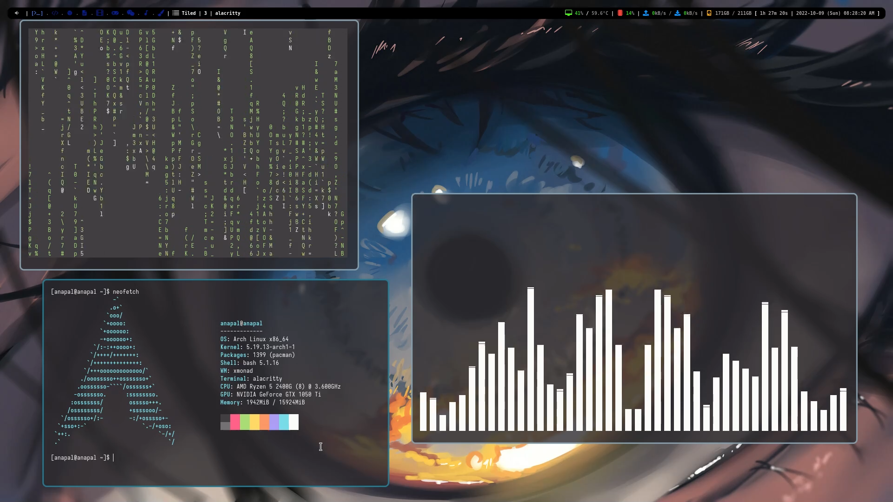
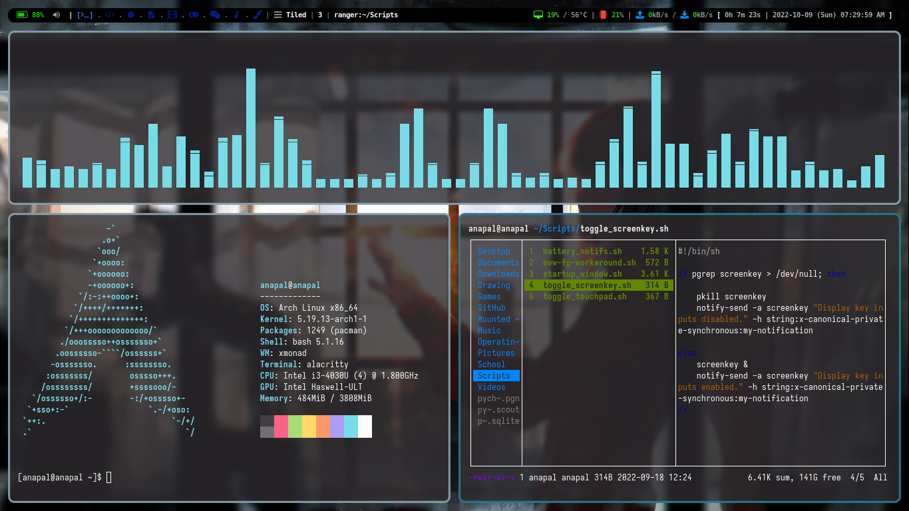
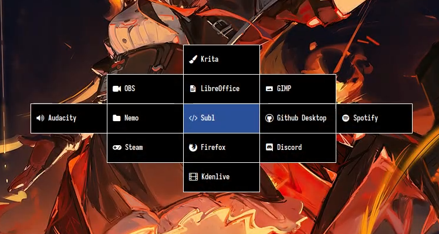
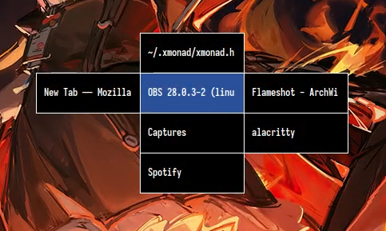

 
   <h1>
      my dotfiles  
      
      
      
      
      
      
      
   </h1> 
   scripts and configuration files for programs, window managers, and other stuff I use, kept here for safe keepings.

 

## includes

### window managers
- [**xmonad**](https://xmonad.org/) - window manager

### status bars
- [**eww**](https://github.com/elkowar/eww) - widgets
- [**xmobar**](https://github.com/jaor/xmobar) - status bar

### display managers
- [**lightdm**](https://github.com/canonical/lightdm) - display manager 

### compositors
- [**picom** (jonaburg fork)](https://github.com/jonaburg/picom) - X11 compositor

### applications
- [**alacritty**](https://github.com/alacritty/alacritty) - terminal
- [**cmus**](https://cmus.github.io/) - music player
- [**dunst**](https://dunst-project.org/) - notification daemon
- [**pacman**](https://wiki.archlinux.org/title/pacman) - package manager
- [**neofetch**](https://github.com/dylanaraps/neofetch) - system information tool
- [**htop**](https://htop.dev/) - task manager
- [**ranger**](https://github.com/ranger/ranger) - file manager 
- [**screenkey**](https://gitlab.com/screenkey/screenkey) - displays keystrokes
- [**spotifyd**](https://github.com/Spotifyd/spotifyd) - Spotify client as a daemon

### miscellaneous
- **apps**
    - *App files.*
- **scripts** 
    - *Script files.*
- **systemd**
    - user
        - *Includes service files.*

## preview

   
    
   xmonad.hs config

 

 

   
    
   xmonad.laptop.hs config

 

 

   
    
   spawnSelected in xmonad

   
    
   goToSelected in xmonad

 

 

   
    
   eww widget music notifications

