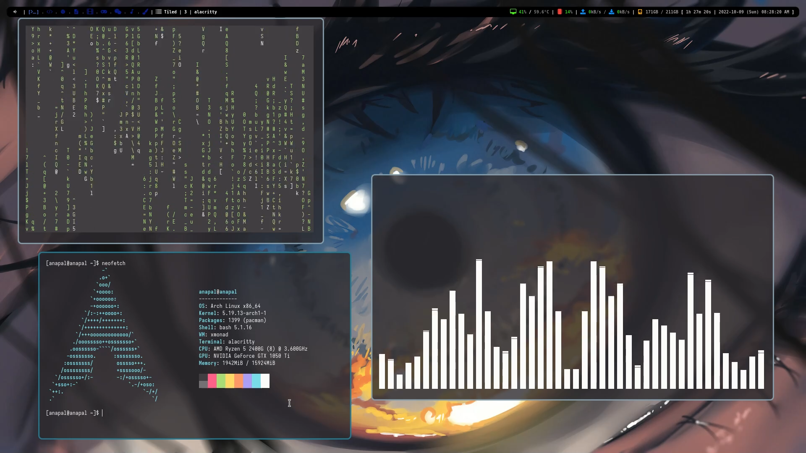
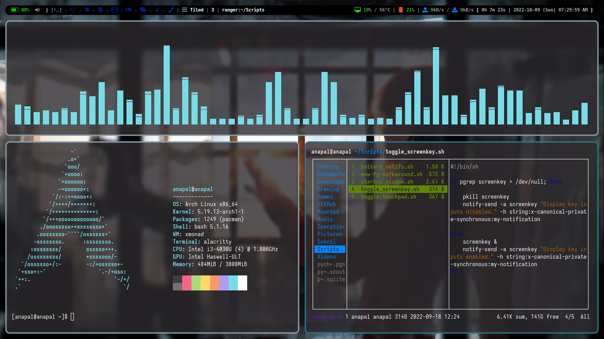

# my dotfiles
 scripts and configuration files for programs I use for safe keepings.

## includes

- **alacritty** - terminal
- **cmus** - music player
- **dunst** - notification daemon
- **eww** - widgets
- **htop** - task manager
- **lightdm** - display manager 
- **neofetch** - system information tool
- **pacman** - package manager
- **picom** - X11 compositor
- **ranger** - file manager 
- **screenkey** - displays keystrokes
- **spotifyd** - Spotify client as a daemon
- **xmonad** - window manager
- **xmobar** - status bar
- **other**
    - Miscellaneous stuff.
    - **apps**
        - *App files.*
    - **scripts** 
        - *Script files.*
    - **systemd**
        - user
            - *Includes service files.*

## preview

   
    
   xmonad.hs config

 

 

   
    
   xmonad.laptop.hs config

 

 

   
    
   eww widget music notifications

